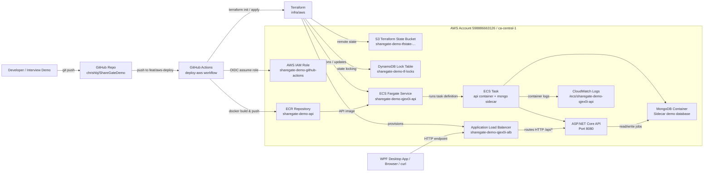

# AWS Deployment Relationship Diagram

This diagram shows how the GitHub repository, CI/CD workflow, Terraform state, AWS compute, container registry, logs, and client entry points relate to each other in the AWS demo deployment.



## Public Endpoint

Base URL:

```text
http://sharegate-demo-qjex0i-alb-1455212926.ca-central-1.elb.amazonaws.com
```

Health check:

```text
http://sharegate-demo-qjex0i-alb-1455212926.ca-central-1.elb.amazonaws.com/api/health
```

## Console Locations

- Region: `Canada (Central) ca-central-1`
- ECS cluster: `sharegate-demo-qjex0i-cluster`
- ECS service: `sharegate-demo-qjex0i-api`
- Load balancer: `sharegate-demo-qjex0i-alb`
- ECR repository: `sharegate-demo-api`
- CloudWatch log group: `/ecs/sharegate-demo-qjex0i-api`
- Terraform state bucket: `sharegate-demo-tfstate-598886663126-ca-central-1`
- Terraform lock table: `sharegate-demo-tf-locks`

## Demo Architecture Note

The MongoDB container is intentionally deployed as a sidecar in the same ECS task for a lightweight interview demo. This keeps the deployment self-contained and cheap, but it also means data is local to the running task. For production, the data layer should move to a managed/shared service such as Amazon DocumentDB, MongoDB Atlas, or another persistent database service.

